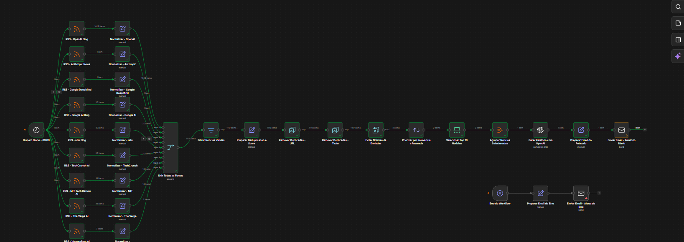
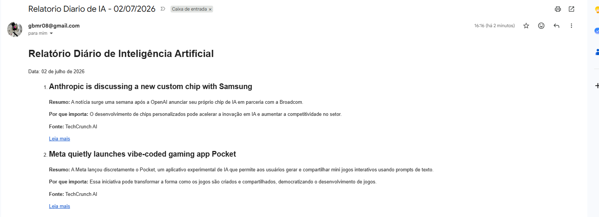

# Relatório Diário de Inteligência Artificial com n8n

Automação criada no **n8n** para coletar notícias de inteligência artificial em diferentes fontes RSS, remover conteúdos duplicados, priorizar as notícias mais relevantes, gerar um resumo com IA e enviar um relatório diário por e-mail.

## Objetivo do projeto

O projeto foi desenvolvido para automatizar uma tarefa recorrente: acompanhar notícias de IA em várias fontes e transformar esse volume de informações em um relatório curto, organizado e fácil de consumir.

A automação reduz o trabalho manual de abrir diferentes sites, comparar notícias repetidas, selecionar os assuntos mais importantes e preparar o conteúdo do e-mail.

## Como o workflow funciona

1. O fluxo é iniciado automaticamente por um agendamento diário.
2. As notícias são coletadas em diferentes feeds RSS.
3. Os dados recebidos de cada fonte são normalizados para um formato único.
4. Todas as fontes são reunidas em um único fluxo.
5. Notícias inválidas ou sem informações essenciais são removidas.
6. O workflow cria uma chave de deduplicação e uma pontuação de relevância.
7. Duplicidades por URL e por título são eliminadas.
8. Notícias já processadas em execuções anteriores são descartadas.
9. As notícias restantes são priorizadas por relevância e atualidade.
10. As principais notícias são agrupadas.
11. Um modelo de IA gera o conteúdo final do relatório.
12. O HTML do e-mail é preparado e enviado automaticamente.

## Principais recursos

- Agendamento automático diário
- Integração com múltiplas fontes RSS
- Normalização dos dados coletados
- Remoção de notícias duplicadas
- Histórico para evitar o reenvio da mesma notícia
- Pontuação por palavra-chave, fonte e atualidade
- Seleção das notícias mais relevantes
- Geração de resumo com IA
- Envio de relatório em HTML por e-mail
- Fluxo separado para tratamento e notificação de erros

## Tecnologias utilizadas

- **n8n** — criação e orquestração do workflow
- **RSS Feed** — coleta das notícias
- **OpenAI** — geração e organização do relatório
- **Gmail/SMTP** — envio do e-mail
- **JavaScript Expressions** — tratamento e transformação dos dados no n8n
- **Codex** — apoio na criação, validação e documentação da solução

## Visão geral do workflow

O fluxo conecta as fontes RSS aos processos de normalização, filtragem, deduplicação, classificação, geração de conteúdo e envio do relatório.



## Resultado final

O relatório é enviado por e-mail com título, resumo, motivo de relevância, fonte e link para leitura de cada notícia selecionada.



## Estrutura lógica

```text
Agendamento diário
        ↓
Coleta em múltiplos feeds RSS
        ↓
Normalização dos dados
        ↓
União das fontes
        ↓
Validação das notícias
        ↓
Deduplicação por URL e título
        ↓
Remoção de notícias já enviadas
        ↓
Priorização por relevância e atualidade
        ↓
Seleção das principais notícias
        ↓
Geração do relatório com IA
        ↓
Preparação do HTML
        ↓
Envio do e-mail
```

## Configuração

Para executar o projeto em outra instância do n8n, é necessário:

1. Importar o arquivo JSON do workflow no n8n.
2. Configurar as credenciais do modelo de IA utilizado.
3. Configurar a credencial do Gmail ou servidor SMTP.
4. Revisar os endereços dos feeds RSS.
5. Definir o e-mail remetente e o destinatário.
6. Ajustar o horário do agendamento diário.
7. Executar o workflow manualmente para validar todos os nodes.
8. Ativar o workflow após os testes.

## Cuidados com segurança

Credenciais, tokens e chaves de API não devem ser adicionados ao repositório. O n8n armazena essas informações separadamente nas credenciais da instância.

Antes de publicar o workflow JSON, verifique se ele não contém:

- chaves de API;
- tokens de acesso;
- senhas;
- endereços de e-mail pessoais que você não queira divulgar;
- dados privados de execuções anteriores.

## Desafios resolvidos

Durante o desenvolvimento, alguns pontos precisaram ser ajustados:

- configuração da integração entre Codex e n8n;
- importação do workflow em JSON;
- configuração da credencial de envio de e-mail;
- correção do corpo HTML que inicialmente chegava vazio;
- criação de uma chave de deduplicação;
- remoção de notícias já enviadas em execuções anteriores;
- filtragem e priorização de notícias recentes.

## Aprendizados

Este projeto permitiu praticar conceitos importantes de automação e agentes de IA:

- integração entre diferentes serviços;
- tratamento de dados vindos de múltiplas fontes;
- criação de regras de deduplicação;
- uso de IA generativa dentro de um fluxo automatizado;
- construção de mensagens HTML;
- configuração de credenciais com segurança;
- tratamento de erros e observabilidade do workflow.

## Próximas melhorias

- Adicionar novas fontes de notícias.
- Criar categorias como IA generativa, agentes, automação e mercado.
- Melhorar a pontuação de relevância com critérios configuráveis.
- Armazenar o histórico das notícias em banco de dados ou planilha.
- Criar uma versão com envio pelo WhatsApp ou Telegram.
- Adicionar métricas sobre quantidade de notícias coletadas, descartadas e enviadas.
- Criar uma interface para personalizar fontes, palavras-chave e horário do relatório.

## Autor

**Guilherme Brito**  
Projeto desenvolvido como parte dos estudos em inteligência artificial, automação e criação de agentes.
